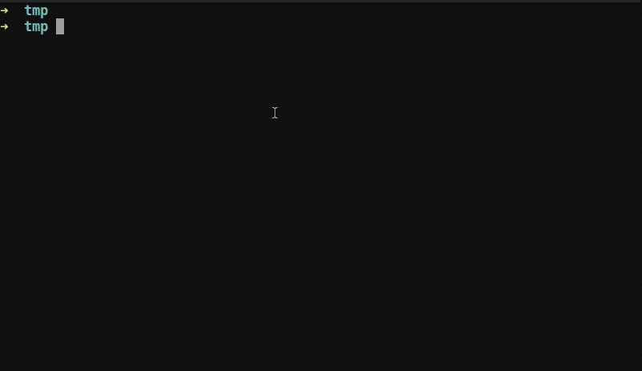

# neogdb.vim
Vim GDB front-end for neovim: https://github.com/huawenyu/neogdb.vim  
The code reference: https://github.com/neovim/neovim/blob/master/contrib/gdb/neovim_gdb.vim  

## feature
  - gdb commands maps: next, step, finish, continue, etc.
  - breakpoints:
    + auto save/load,
    + populate to local list: lopen
    + side color sign
    + triple state: enable -> disable -> delete
    + toggle current line/toggle-all-breakpoints
    + support condition set
  - backtrace:
    + populate to quickfix: copen

## layout

```
+-------------------------+--------------------------+
|                         |                          |
|                         |                          |
|                         |                          |
|                         |    terminal>             |
|     Code c/c++          |    (gdb)                 |
|                         |                          |
|                         |                          |
|                         |                          |
|                         |                          |
|                         +--------------------------+
|                         |                          |
+-------------------------+  backtrace               |
| breakpoints             |                          |
|                         |                          |
+-------------------------+--------------------------+

```
## Screen Demo

Press <F2> to toggle Nbgdb or Nbgdbattach.

### gdb directly

    :Nbgdb t1

### gdb attach pid

So far, the `attach` call by `sudo`, so maybe we should input the **sudo-password**. The reason is:
    [gdb-attach-fails-with-ptrace-operation-not-permitted](https://blog.mellenthin.de/archives/2010/10/18/gdb-attach-fails-with-ptrace-operation-not-permitted/)

    :Nbgdbattach t1 <t1-pid>

### gdb remote target

    :Nbgdbattach sysinit/init 10.1.1.125:444

### gif

[](#features)

# Install

## Install if no any plugin manager

The file structure should be clear, just copy the github.vim into ~/.vim/plugin/

## Installing when using [Vundle](https://github.com/VundleVim/Vundle.vim)

Add the following line to the plugins regions of ``~/.vimrc``:

```vim
Plugin 'huawenyu/neogdb.vim'
```

## Installing when using [Pathogen](https://github.com/tpope/vim-pathogen)

```Shell
    cd ~/.vim/bundle
    git clone git@github.com:solars/github-vim.git
```

# Usage

## commands
  - :GdbLocal
  - :GdbDebugStop
  - :GdbToggleBreakpoint
  - :GdbClearBreakpoints
  - :GdbContinue
  - :GdbNext
  - :GdbStep
  - :GdbFinish
  - :GdbFrameUp
  - :GdbFrameDown
  - :GdbInterrupt
  - :GdbEvalWord
  - :GdbWatchWord

## Default keymaps
  - `<F2>` Helper Start
  - `<F4>` continue
  - `<F5>` next
  - `<F6>` step
  - `<F7>` finish
  - `<F8>` util
  - `<F9>` Normal-mode: breakpoints
  - `<F9>` Select-Mode: print <var>

## Sample

  There have a c file `autoload/examples/t1.c` in the plugin's dir.
  Please copy it to your test dir.

```sh
    ### compile test
    $ cd /dir/of/file/t1.c
    $ gcc -g -O0 -o t1 t1.c
    ### start gdb
    $ vi t1.c
      If default keymap, <F2>, the command line show `:Nbgdb t1`, <Enter> to start gdb.
```

# Customization

Put these in your ``~/.vimrc`` to customize the keymaps:

## keymaps leader

If define *g:neobugger_leader*, will *ignore* all *g:gdb_keymap_...* customized.

```vim
let g:neobugger_leader = ';'
```

Then the keymaps will be `g:neobugger_leader` + `<char>`, the `<char>` like:
  - `r`: GdbRefresh
  - `c`: GdbContinue
  - `n`: GdbNext
  - `i`: GdbStep
  - `N`: GdbFinish
  - `t`: GdbUntil
  - `b`: GdbToggleBreak
  - `a`: GdbToggleBreakAll
  - `C`: GdbClearBreak
  - `x`: GdbDebugStop
  - `k`: GdbFrameUp
  - `j`: GdbFrameDown

## keymaps without leader

```vim
let g:gdb_keymap_continue = '<f8>'
let g:gdb_keymap_next = '<f10>'
let g:gdb_keymap_step = '<f11>'
" Usually, F23 is just Shift+F11
let g:gdb_keymap_finish = '<f23>'
let g:gdb_keymap_toggle_break = '<f9>'
" Usually, F33 is just Ctrl+F9
let g:gdb_keymap_toggle_break_all = '<f33>'
let g:gdb_keymap_frame_up = '<c-n>'
let g:gdb_keymap_frame_down = '<c-p>'
" Usually, F21 is just Shift+F9
let g:gdb_keymap_clear_break = '<f21>'
" Usually, F17 is just Shift+F5
let g:gdb_keymap_debug_stop = '<f17>'
```

## Miscellaneous

### config windows

Current implement only support two kinds of windows: `backtrace`, `breakpoint`.
The default config is:
- local-mode, diable these windows
- attach-mode, open them

But we can modify the default bahaviour by config:

```vim
let g:neogdb_window = ['backtrace', 'breakpoint']
```

### Customize attach parameter

The ``Nbgdbattach`` always use `target remote` to connect a real searver which is different in everyone's env.  
So we can specific a local host by put these into `.vimrc`:

```vim
if exists("$NBG_ATTACH_REMOTE_STR")
  let g:neogdb_attach_remote_str = $NBG_ATTACH_REMOTE_STR
else
  let g:neogdb_attach_remote_str = 'sysinit/init 192.168.0.180:444'
endif
```

Or define a env var `NBG_ATTACH_REMOTE_STR` by putting in `.bashrc`:
```shell
export NBG_ATTACH_REMOTE_STR="sysinit/init 192.168.0.180:444"
```

### Enable restart

By default, if you run ``Nbgdb`` or ``Nbgdbattach`` when GDB is already started,  
the plugin will send an interrupt (``<c-c>``) followed by a ``start``.  
This is in order to speed up the edit-compile-test cycle.  
If you instead want an error to be thrown when GDB is already started, change this variable:


```vim
let g:restart_app_if_gdb_running = 0
```

By default, the plugin toggles the breakpoint right after pressing ``g:gdb_keymap_toggle_break``.  
If this flag is set to 1, the plugin will require you to confirm the command with Enter which lets you edit the command before issuing it:

### others

```vim
let g:gdb_require_enter_after_toggling_breakpoint = 0
```

To send your own commands to GDB:

```vim
" Prints the value of the variable under the cursor
nmap <Space>p :call neobugger#gdb#Send("print " . expand('<cword>'))<CR>
```

### Map and unmap callbacks

You can run your own code when Neogdb sets its keymaps.  
The plugin will call ``NeogdbvimNmapCallback`` on initialization and ``NeogdbvimUnmapCallback`` on exiting, if these functions exist.  

For example, you can put this in your ``~/.vimrc``:

```vim
function! NeogdbvimNmapCallback()
    " Let fzf.vim open files in the current window by default.
    " This is so that, when navigating files,
    " we don't switch to a new tab and thus *always* see the neogdb's splits. 
    let g:fzf_action = { 'enter': 'edit' }
endfunc

function! NeogdbvimUnmapCallback()
    " Quitting to normal editing. Let fzf.vim open files in the new tab,
    " as usual.
    let g:fzf_action = { 'enter': 'tabnew' }
endfunc
```

## Troubleshooting by log

### Enable **print c-tyle** log

```vim: add plugin-log to your ~/.vimrc
    Plug 'huawenyu/vimlogger'

    " Also append this line to your ~/.vimrc to start our logfile
    silent! call logger#init('ALL', ['/tmp/vim.log'])
```

### Check runtime log

- Start vim
- Using another terminal, off couse it's easy if you using `tmux` which you'll not regret to meet the tools.
  watching the log by `tail -f /tmp/vim.log`

# License
Vim license, see LICENSE
